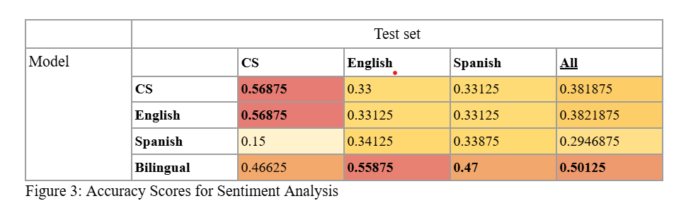

# Code-Switching & Multilingual PLMs (Replication + Fine-tuning)

Course project (Computational Linguistics) that evaluates how multilingual pre-trained language models (PLMs) handle **code-switching** across (1) probing/detection-style experiments and (2) downstream **fine-tuning** for **sentiment analysis** and **POS tagging** on monolingual, bilingual, and code-switched data.

## Demo
- 📌 **Canonical repo (full implementation):** https://github.com/Pun2341/cl2-code-switching-plm
- 📄 Paper: `paper/paper.pdf`

### Results snapshots

<p align="center">
  
  
</p>

<p align="center">
  <em>
    Accuracy by training condition (rows) vs. evaluation split (columns). Bilingual training is the most robust overall; CS training is strongest on CS test data.
  </em>
</p>

---

## Features
- **Replication pipeline** for code-switching analysis with multilingual PLMs
- **Layer-wise probing**: extract embeddings and train lightweight classifiers to measure where CS signals are encoded
- **Downstream fine-tuning**
  - **Sentiment analysis** (sequence classification)
  - **POS tagging** (token classification)
- Comparisons across **English-only**, **Spanish-only**, **Bilingual (EN+ES)**, and **Code-Switched (CS)** training setups
- Result reporting + plots for quick qualitative comparison

## Tech Stack
- Python
- PyTorch + Hugging Face Transformers
- scikit-learn (probing/classifiers)
- NumPy / Pandas
- Matplotlib / Seaborn (plots)

## Architecture
This repo is a **showcase** and intentionally lightweight. The complete pipeline (datasets, preprocessing, training scripts, notebooks) is in the canonical repo:

- **Full repo:** https://github.com/Pun2341/cl2-code-switching-plm

Layout for this showcase repo:
- `paper/` — final write-up PDF
- `assets/` — key plots/tables (e.g., the two accuracy heatmaps above)
- `README.md` — summary + reproduction link

## Getting Started (quick local run)
The scripts are included in the original repo, you can run them like this:

### Install
```bash
python -m venv .venv
source .venv/bin/activate  # macOS/Linux
# .venv\Scripts\activate   # Windows

pip install -r requirements.txt
```
### Run: Sentence-level CS classification (SVM over embeddings)
```bash
python classifier_cs.py
```
### Run: LID probing (layer-wise F1)
```bash
python lid.py
```

## Results(high level)
- Multilingual PLMs encode language identity strongly enough that simple probing classifiers achieve high performance on CS detection tasks.
- Fine-tuning on bilingual data generally improves robustness across languages; CS-specific training helps most on CS test sets.

## Credits
Course project by:
- Majd Aldaye
- Pun Chaixanien
- Nicholas Chernogor
- Kidus Zegeye

This repo is a showcase/summary; see the canonical repo for full implementation.

